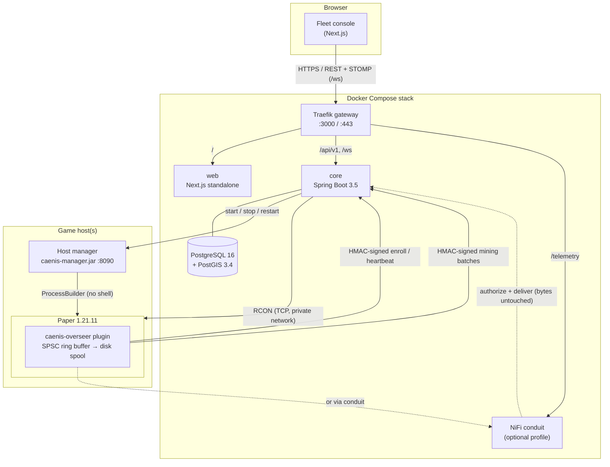

<div align="center">

# Caenis Overseer

**Fleet operations and out-of-tick anti-cheat telemetry for PaperMC networks.**

*Keep the tick for the game.*

[](LICENSE)


</div>

---

Caenis is a self-hosted platform for running a network of Minecraft **Paper** servers. You get:

- **A lightweight in-game agent** (`caenis-overseer`). It captures mining events and server health without doing any analysis on the main thread.
- **An analytical core** (Spring Boot). It verifies signed telemetry, runs deterministic anti-cheat detectors, stores spatial history in PostGIS, and dispatches RCON commands.
- **A fleet console** (Next.js). It shows fleet health, a tactical map of mining activity, a searchable alert feed, a web RCON terminal and an append-only audit log, with access controlled by role.
- **An optional host manager** that starts, stops and restarts Paper processes. It only runs directories you configure in advance.

## Why

Most anti-cheat plugins run their checks inside the server tick, which has a 50 ms budget at 20 TPS. Raycasts, neighbour inspections and statistical rollups all take time away from the game. Caenis splits the work:

> The game server does only the cheapest possible thing: capture the event, sample the six neighbouring faces of the block from memory, and put it in a bounded queue. Everything else runs outside the game.

Fleet tooling is usually just as scattered: a panel for processes, a separate RCON client, per-server logging and isolated anti-cheat instances. Caenis puts these into one control plane with one audit trail.

---

## Table of contents

- [Architecture](#architecture)
- [Repository layout](#repository-layout)
- [Features](#features)
- [Detection model](#detection-model)
- [Quick start](#quick-start)
- [Connecting a Paper server](#connecting-a-paper-server)
- [Lifecycle control (host manager)](#lifecycle-control-host-manager)
- [Configuration reference](#configuration-reference)
- [Roles and permissions](#roles-and-permissions)
- [Security model](#security-model)
- [Delivery guarantees and retention](#delivery-guarantees-and-retention)
- [API overview](#api-overview)
- [Development](#development)
- [Project status](#project-status)
- [Further documentation](#further-documentation)
- [License](#license)

---

## Architecture



| Component | Does | Never does |
| --- | --- | --- |
| **`paper-plugin`** (`caenis-overseer.jar`) | Captures block-damage → block-break timing and a 6-face exposure bitmask. Reports TPS/MSPT/heap/chunks/entities/players every 5 s. Signs and spools batches off-thread. | Runs detector maths, loads neighbouring chunks, or does network/disk I/O on the tick thread. |
| **`backend-service`** (`caenis-core.jar`) | Agent authentication, detectors, PostGIS persistence, fleet registry, RCON pool, command gateway, audit log, auth/RBAC, STOMP invalidation. | Changes game state without an explicit operator command or opt-in automation rule. |
| **`backend-service-servermanager`** (`caenis-manager.jar`) | Starts, stops and restarts pre-configured Paper directories/JARs on the host. | Accepts command text, environment variables, paths or uploads from a request. |
| **`caenis-web`** | Public landing page with an interactive pipeline explainer, plus the authenticated console. | Computes heuristics. The core re-checks every request. |
| **NiFi conduit** (optional) | Durable buffering and backpressure between the agents and the core. Checks each request with the core's `authorize` endpoint before accepting it. | Holds detector logic or per-node secrets, or re-serialises signed payloads. |

## Repository layout

```
.
├── paper-plugin/                    # Paper agent (Kotlin, shaded → caenis-overseer.jar)
├── common-dto/                      # Shared kotlinx.serialization DTOs + HMAC request signing
├── backend-service/                 # Analytical core & management API (Spring Boot)
│   └── src/main/resources/db/migration/   # Flyway schema (PostGIS, append-only audit)
├── backend-service-servermanager/   # Host lifecycle manager (Spring Boot)
├── caenis-web/                      # Next.js 16 console (App Router, Tailwind v4, shadcn/ui)
├── docker/
│   ├── traefik/                     # Gateway routing (HTTP and ACME/HTTPS variants)
│   ├── postgres/                    # Creates the least-privilege runtime DB user
│   ├── nifi/                        # Conduit provisioning script + README
│   └── manager/                     # Example host-manager instance config
├── scripts/                         # PowerShell 7 operator scripts (init, start, package, backup)
├── docs/                            # Contracts, operations guide, architecture notes
├── docker-compose.yml               # postgres · core · web · gateway · nifi (profile)
└── docker-compose.https.yml         # Overlay: public HTTPS with Let's Encrypt
```

## Features

### Fleet operations
- **Instance registry** for up to 256 Paper nodes, grouped by cluster and region. Each node gets its own agent key, which is shown once and can be rotated.
- **Live health**: TPS (1/5/15 m), MSPT, heap, loaded chunks, entities, player roster with ping, agent queue depth, dropped events and spool size.
- **Health history**: minute-level aggregates covering the last 1–72 hours.
- **Dead-node detection**: a node that misses three heartbeat cycles (15 s) is marked `UNREACHABLE`, and the event is audited.
- **Web RCON terminal**: SuperAdmins can send raw commands. Moderators get predefined actions (`kick`, `freeze`, `unfreeze`, `spectate`) for players who are currently online. Output streams to the browser over STOMP.
- **Lifecycle control**: start, stop and restart through the host manager.
- **Append-only audit log**: every command, lifecycle action, automated intervention and baseline training run is recorded with actor, target, correlation ID and outcome (`QUEUED` → `DISPATCHING` → `SUCCEEDED` / `REJECTED` / `UNCERTAIN`).

### Tactical observation
- **Tactical map**: a hand-written `<canvas>` renderer for Minecraft X/Z space with pan and zoom. Distinguishes exposed breaks, occluded breaks and rare ores. The server clusters wide views using PostGIS.
- **Alert feed**: searchable by type, diagnostics, coordinates and (except for Analysts) player.
- **Stats header**: retained events, alerts, critical alerts, ingestion rate and automated interventions.
- **Pseudonymised analyst view**: for the Analyst role, player UUIDs and names are replaced by stable HMAC-derived aliases.

### Anti-cheat telemetry
- **Fast-mining detection**: compares the measured dig time against the theoretical minimum from game physics.
- **X-ray detection**: flags a high share of fully occluded valuable-ore breaks within a sliding window.
- **Per-player baselines**: trained on an operator-reviewed period of legitimate play, which raises the occlusion threshold for players who naturally mine that way.
- **Opt-in automated containment**: tightly rate-limited `kick` or `freeze`.

## Detection model

Both detectors are deterministic, so every alert says why it fired (for example `Observed 180ms; theoretical 750ms; tolerance 100ms`).

### Fast mining: temporal kinetic verification

The agent times each dig from `BlockDamageEvent` to `BlockBreakEvent` on the **same block**. The timing is marked unreliable if the player changes tool, effects, ground/water state or held item during the dig. Unreliable or unknown timings never reach the detector.

The core then reproduces the vanilla dig formula:

```
speed  = toolMultiplier
       + (efficiency² + 1)            if the tool is effective and enchanted
       × (1 + 0.2 × hasteLevel)
       × 0.3^fatigueLevel             (vanilla fatigue table)
       ÷ 5                            if submerged without Aqua Affinity
       ÷ 5                            if not on ground

damagePerTick = speed / hardness / (30 if harvestable else 100)
theoreticalMs = ceil(1 / damagePerTick) × 50
```

The result is capped by Paper's native `getBreakSpeed` reference when the plugin sends it. A break is flagged when `observed < theoretical − jitter`, where jitter defaults to 100 ms and is configurable per instance. Severity depends on `observed / theoretical`: below 0.35 is **CRITICAL**, below 0.6 is **HIGH**, otherwise **MEDIUM**. Blocks with unknown hardness are skipped instead of being given a guessed threshold.

### X-ray: topological occlusion analysis

For each tracked break, the agent checks the six orthogonal neighbours for non-occluding or liquid blocks. It **never loads a chunk to do this**. If the topology is incomplete, the event is excluded from this detector.

For valuable ores (diamond, gold, emerald, ancient debris), the core looks at the player's last ≤ 25 breaks in the same instance and world over 15 minutes:

```
R_occluded = occluded breaks / total breaks        (requires ≥ 10 samples)
```

The default threshold is **τ = 0.75**. If the player has a trained baseline (≥ 100 reviewed samples), τ is raised to `max(0.75, min(0.98, μ + 3σ + 0.1))` from a smoothed Beta-Binomial estimate of that player's historical occlusion rate. Alerts have a two-minute cooldown per player.

> Occlusion is **supporting evidence only**. It never triggers automated containment on its own.

### Automated containment

It is **off by default** and enabled per instance. When enabled, it only fires if all of these are true:

- the alert is a **CRITICAL fast-mining** alert, and there are **≥ 3** of them for that player within one minute;
- the event is at most 15 s old, so a backlog replayed after an outage cannot trigger it;
- the player has had no action in the last 5 minutes, and the instance has had no more than 5 actions in the last minute;
- the instance is online and the player is still in its roster.

The configured action is either `kick` or `freeze`. Freeze uses the plugin's console-only `/caenis freeze <uuid>`, lasts at most five minutes and clears on plugin restart.

## Quick start

### Prerequisites

| Tool | Needed for |
| --- | --- |
| Docker with Compose v2 | Running the stack |
| PowerShell 7 (`pwsh`) | The helper scripts (Windows, Linux or macOS) |
| JDK 21 | Building the plugin and host-manager JARs |
| Node 24 + pnpm 10 | Working on the web console outside Docker (optional) |

### 1. Generate secrets

```powershell
pwsh ./scripts/Initialize-Caenis.ps1                     # local: http://localhost:3000
# or
pwsh ./scripts/Initialize-Caenis.ps1 -PublicOrigin https://caenis.example.com
```

This writes a `.env` file with random 32-byte secrets and restricts it to your user. It refuses to overwrite an existing `.env`, and it prints no secrets.

<details>
<summary>Without PowerShell (bash + openssl)</summary>

```bash
gen() { openssl rand -base64 32; }
cat > .env <<EOF
CAENIS_PUBLIC_ORIGIN=http://localhost:3000
CAENIS_SECURE_COOKIES=false
CAENIS_ADMIN_USERNAME=admin
CAENIS_ADMIN_PASSWORD=$(gen)
CAENIS_SESSION_SECRET=$(gen)
CAENIS_ENCRYPTION_KEY=$(gen)
DATABASE_PASSWORD=$(gen)
DATABASE_OWNER_PASSWORD=$(gen)
CAENIS_MANAGER_KEY=$(gen)
NIFI_USERNAME=caenis
NIFI_PASSWORD=$(gen)
NIFI_SENSITIVE_KEY=$(gen)
CAENIS_BIND=127.0.0.1
CAENIS_HTTP_PORT=3000
EOF
chmod 600 .env
```
</details>

### 2. Start the platform

```powershell
pwsh ./scripts/Start-Caenis.ps1            # or: docker compose up --build -d
pwsh ./scripts/Start-Caenis.ps1 -WithNiFi  # include the optional NiFi conduit
```

### 3. Sign in

Open <http://localhost:3000>. Choose **Open console** and sign in as `admin` using the `CAENIS_ADMIN_PASSWORD` value from `.env`. The first SuperAdmin account is created on first boot.

## Connecting a Paper server

1. **Build the artifacts**
   ```powershell
   pwsh ./scripts/Package-Caenis.ps1   # → dist/caenis-overseer.jar, caenis-core.jar, caenis-manager.jar
   ```
2. **Install the agent** by copying `dist/caenis-overseer.jar` into the server's `plugins/` directory (Paper **1.21.11**).
3. **Register the instance** under **Fleet** with an ID such as `srv-survival-01`. Save the agent key it shows; it is displayed only once. Download the generated `config.yml` into `plugins/CaenisOverseer/config.yml`:
   ```yaml
   instance:
     id: "srv-survival-01"
     secret: "<agent key from the console>"
   backend:
     url: "http://127.0.0.1:3000"      # must be reachable from the Paper host
     telemetry-url: ""                  # empty = direct; NiFi: http://<conduit>:8085/telemetry
     timeout-seconds: 3
   collector:
     queue-capacity: 8192
     spool-max-mb: 128
   ```
   You can also set `CAENIS_INSTANCE_ID`, `CAENIS_AGENT_SECRET` and `CAENIS_BACKEND_URL` as environment variables instead.
4. **Restart Paper.** The agent enrols, gets a 15-minute session token that it renews automatically, and starts sending heartbeats every 5 s.
5. **Enable RCON** in `server.properties` (`enable-rcon=true`, `rcon.port=25575`, and your own `rcon.password`). Then enter the host, port and password in the instance's connection settings.
   > RCON is unencrypted. Keep it on a private network or VPN.

## Lifecycle control (host manager)

RCON can control a server that is running, but it cannot start one that is stopped. That is what `caenis-manager.jar` is for.

```powershell
# 1. Prepare a server directory and accept the Minecraft EULA yourself
#    servers/survival/paper.jar
#    servers/survival/eula.txt  → eula=true
# 2. Describe the instances this host may run
Copy-Item docker/manager/application-manager.example.yml runtime/application-manager.yml
# 3. Start the manager (binds 127.0.0.1:8090 by default)
pwsh ./scripts/Start-Manager.ps1                 # add -Bind <private-ip> if the core runs in Docker
```

```yaml
# runtime/application-manager.yml
caenis:
  manager:
    instances:
      srv-survival-01: { directory: survival, jar: paper.jar, memory-mb: 4096 }
      srv-hub-01:      { directory: hub,      jar: paper.jar, memory-mb: 2048 }
```

In the console, set the instance's **manager URL** and the `CAENIS_MANAGER_KEY`. After that, Start, Stop and Restart work from the instance page.

Guarantees:
- It never uses a shell. Only configured directories and JARs inside the servers root can be launched.
- It **never accepts the EULA** for you.
- Stop sends `stop` on stdin and waits up to 35 s. If the world is still saving after that, it reports so and **does not kill the process**.
- A PID and start-time marker plus a file lock stop two managers, or a restarted manager, from starting the same world twice.

## Configuration reference

### Stack (`.env`)

| Variable | Purpose |
| --- | --- |
| `CAENIS_PUBLIC_ORIGIN` | Public origin of the console, used for CORS/WebSocket origin checks. |
| `CAENIS_SECURE_COOKIES` | `true` behind HTTPS. |
| `CAENIS_ADMIN_USERNAME` / `CAENIS_ADMIN_PASSWORD` | First SuperAdmin account. The password must be 16–72 bytes. |
| `CAENIS_SESSION_SECRET` | HS256 key for session tokens (≥ 32 bytes). Shared by the core and web. |
| `CAENIS_ENCRYPTION_KEY` | Base64 AES-256-GCM key that encrypts agent secrets, RCON passwords and manager keys. **Back it up.** |
| `DATABASE_PASSWORD` / `DATABASE_OWNER_PASSWORD` | Runtime (least-privilege) and migration-owner DB passwords. |
| `CAENIS_MANAGER_KEY` | Shared key for the host manager (≥ 32 chars). |
| `NIFI_USERNAME` / `NIFI_PASSWORD` / `NIFI_SENSITIVE_KEY` | NiFi single-user credentials and sensitive-properties key. |
| `CAENIS_BIND` / `CAENIS_HTTP_PORT` | Gateway bind address and port (default `127.0.0.1:3000`). |
| `CAENIS_HOST` / `ACME_EMAIL` | HTTPS overlay only: public hostname and Let's Encrypt contact. |

### Optional core settings

| Variable | Purpose |
| --- | --- |
| `VAULT_ADDR` / `VAULT_TOKEN_FILE` | Load RCON passwords from HashiCorp Vault KV v2 (`data.data.password`), fetched fresh for every command. |
| `OTEL_METRICS_ENABLED` / `OTEL_METRICS_URL` | Export Micrometer metrics over OTLP. |

### Per-instance agent settings (from the console)

| Setting | Default | Range |
| --- | --- | --- |
| `enabled` | `true` | Enables or disables capture on the agent. |
| `batchSize` | 100 | 1–500 events per batch. |
| `flushIntervalMs` | 1000 | 500–10 000 ms. |
| `jitterMs` | 100 | 0–2000 ms of tolerance for the fast-mining check. |
| `debugSampling` | `false` | Tracks every block, not only ores and hard blocks. |
| Automation | off | `kick` or `freeze`. |

## Roles and permissions

| Role | Access |
| --- | --- |
| **SuperAdmin** | Everything: fleet, tactical map, raw RCON, lifecycle, instance connections and agent keys, users, baseline training, metrics. |
| **Moderator** | Fleet health and rosters, tactical map, predefined moderation actions, audit log. |
| **Analyst** | Tactical map, alerts and counters only, with pseudonymised players. No roster, RCON or settings. |

The Next.js route gate is only a convenience. The core loads the persisted session and the account's **current** role on every API call and STOMP frame, so a changed or disabled account takes effect immediately.

## Security model

- **Agent authentication**: every agent request is HMAC-SHA256 signed over `instanceId ⏎ purpose ⏎ timestamp ⏎ nonce ⏎ base64(SHA-256(body))` with a per-instance secret. Nonces are recorded, so replays are rejected and retries are idempotent. Control messages allow ±60 s of clock skew. Mining batches may be up to 24 h old so spooled data can still be delivered.
- **Browser sessions**: HS256 JWT stored in an `HttpOnly`, `SameSite=Strict` cookie with an 8-hour lifetime. Sessions are persisted server-side and revoked on logout or account change. CSRF protection applies to REST mutations and to STOMP `CONNECT`.
- **Secrets at rest**: AES-256-GCM, with Vault as an optional source for RCON passwords.
- **Least-privilege database**: Flyway migrates as `caenis_owner`, and the application runs as `caenis`, which has no `UPDATE`/`DELETE`/`TRUNCATE` on `audit_events`. A trigger also rejects mutations. (A PostgreSQL superuser can still change anything; this is not external WORM storage.)
- **Network**: the database sits on an internal Docker network. The gateway binds to loopback by default. Traefik limits request bodies to 2 MiB.
- **STOMP**: clients may subscribe only to `/topic/changes` (payload-free invalidations) and `/user/queue/commands`, and may send only to `/app/command`.

## Delivery guarantees and retention

| Stage | Behaviour |
| --- | --- |
| In-game queue | Lock-free SPSC ring buffer, 8 192 slots by default. When full, the new event is dropped and counted. |
| Local spool | Batches are written to disk off-thread. 128 MiB by default (up to 1 GiB); the oldest batches are evicted first; maximum age is 24 h. |
| Transport | Exponential backoff from 1 s to 30 s. Health and mining traffic retry independently. Rejected batches are kept in a small quarantine. |
| Core | Idempotent per request (nonce + body hash) and per event (`eventId`). At-least-once delivery, deduplicated when persisted. |
| Retention | Health samples 7 d · raw mining events 30 d · ingress receipts 7 d · alerts and audit are kept indefinitely. |

Dropped and spooled counts are reported in every heartbeat, so data loss shows up in the console.

## API overview

All browser endpoints live under `/api/v1`. Agent endpoints live under `/api/v1/agent/{instanceId}/{enroll|heartbeat|mining|config|authorize}`.

| Area | Endpoints |
| --- | --- |
| Auth | `GET /auth/csrf`, `POST /auth/login`, `GET /auth/me`, `POST /auth/logout` |
| Fleet | `GET/POST /fleet`, `GET /fleet/{id}`, `GET /fleet/{id}/history`, `PUT /fleet/{id}/connections`, `PUT /fleet/{id}/settings`, `POST /fleet/{id}/rotate-key`, `POST /fleet/{id}/lifecycle` |
| Commands | `POST /commands`, `GET /commands/{uuid}` |
| Observation deck | `GET /deck/scopes`, `GET /deck/map`, `GET /deck/alerts`, `GET /deck/stats` |
| Audit | `GET /audit` |
| Users | `GET/POST /users`, `PUT /users/{uuid}` |
| Baselines | `GET /settings/baselines`, `POST /settings/baselines/train` |
| Live | WebSocket/STOMP at `/ws` |

The full contracts (signing, limits, STOMP rules, host-manager API) are in [`docs/CONTRACTS.md`](docs/CONTRACTS.md).

## Development

```bash
# JVM modules (Gradle 8.14 wrapper, JDK 21 toolchain)
./gradlew :paper-plugin:shadowJar                       # → paper-plugin/build/libs/caenis-overseer.jar
./gradlew :backend-service:bootJar                      # → caenis-core.jar
./gradlew :backend-service-servermanager:bootJar        # → caenis-manager.jar

# Run the core locally against a PostGIS database
docker compose up -d postgres
DATABASE_URL=jdbc:postgresql://localhost:5432/caenis_overseer ./gradlew :backend-service:bootRun

# Web console
cd caenis-web
pnpm install
CAENIS_BACKEND_URL=http://127.0.0.1:8080 CAENIS_SESSION_SECRET=<same as core> pnpm dev
```

> The `postgres` service is only on an internal Docker network. To reach it from your host during development, add a temporary `ports` mapping.

**Tech stack:** Kotlin 2.2 · JVM 21 · Paper API 1.21.11 · kotlinx.serialization · Spring Boot 3.5 (Web, Security, WebSocket/STOMP, JDBC/JPA, Actuator) · Flyway · Nimbus JOSE · Micrometer OTLP · PostgreSQL 16 + PostGIS 3.4 · Next.js 16 · React 19 · TypeScript · Tailwind CSS v4 · shadcn/ui · Traefik 3.4 · Apache NiFi 2.11 · Docker Compose.

### Backups

```powershell
pwsh ./scripts/Backup-Caenis.ps1     # → runtime/backups/<timestamp>.dump (pg_dump -Fc)
```

Keep `.env`, and especially `CAENIS_ENCRYPTION_KEY`, in a separate protected backup. Without that key, stored secrets cannot be decrypted. Restore steps are in [`docs/OPERATIONS.md`](docs/OPERATIONS.md#backups-and-recovery).

### Public HTTPS

```bash
# In .env: CAENIS_PUBLIC_ORIGIN=https://your.domain  CAENIS_HOST=your.domain
#          CAENIS_SECURE_COOKIES=true  CAENIS_BIND=0.0.0.0  CAENIS_HTTP_PORT=80  ACME_EMAIL=you@domain
docker compose -f docker-compose.yml -f docker-compose.https.yml up --build -d
```

## Project status

Caenis is under active development and has **not been validated in production**:

- There are no measured accuracy, false-positive or performance figures, and no labelled training data. Treat alerts as leads for human review, not verdicts.
- The automated test suite currently only checks that the Spring contexts load.
- The design assumes **one active core** and up to **256 instances**.
- Mining telemetry is the only gameplay signal ingested today. The movement DTO exists but is not wired in yet.
- The occlusion detector can over-report players who legitimately follow ore veins. Per-player baselines are the mitigation.

## Further documentation

| Document | Contents |
| --- | --- |
| [`docs/CONTRACTS.md`](docs/CONTRACTS.md) | Agent signing protocol, REST/STOMP contracts, host-manager API |
| [`docs/OPERATIONS.md`](docs/OPERATIONS.md) | Operator's guide: install, connect, roles, detection, delivery, RCON, HTTPS, Vault, backups |
| [`docker/nifi/README.md`](docker/nifi/README.md) | Provisioning and queue policy for the optional NiFi conduit |
| [`docs/architecture-brief.md`](docs/architecture-brief.md) | Original design brief and trade-off discussion |

## License

Caenis Overseer is free software, released under the [GNU General Public License v3.0](LICENSE).

*Minecraft is a trademark of Mojang AB. This project is not affiliated with Mojang, Microsoft or the PaperMC team.*
